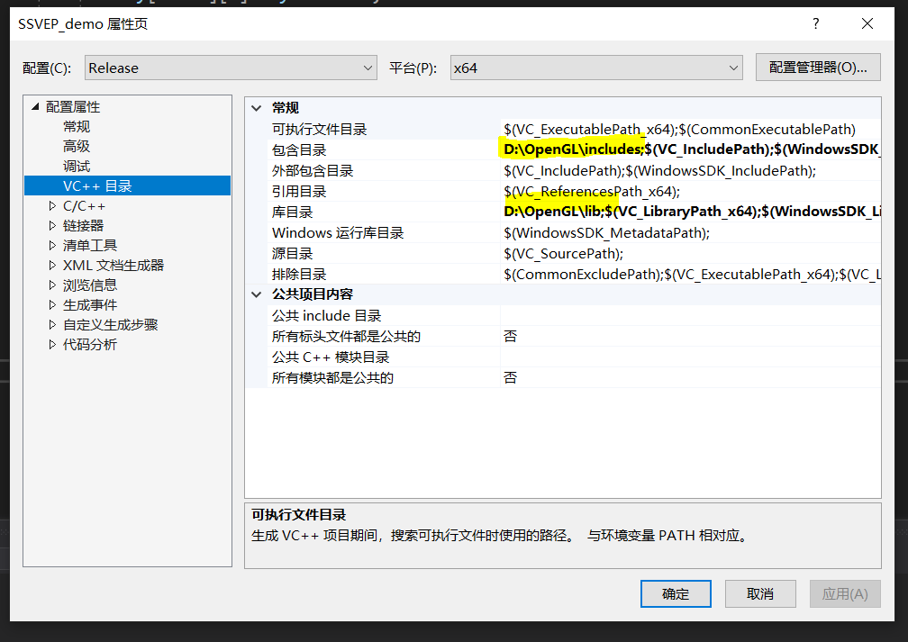
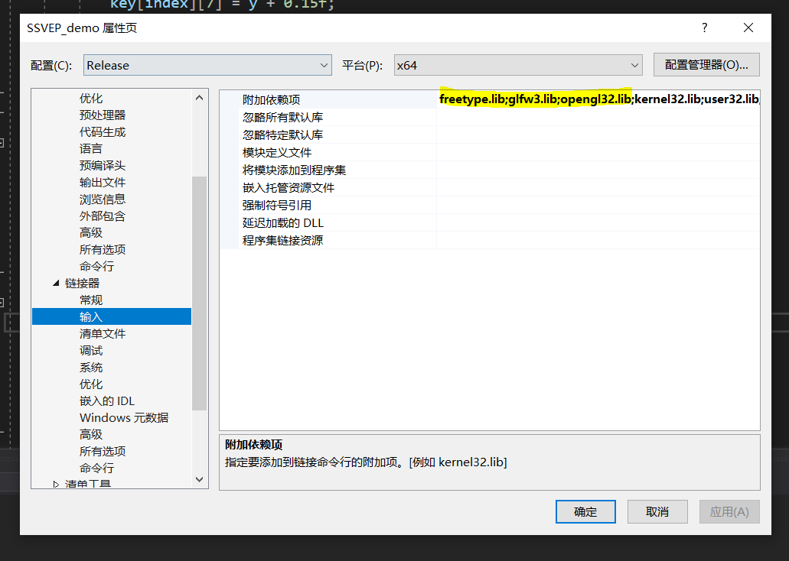

# 交互界面

## Build

### Windows

使用 Visual Studio 构建。

按照[LearnOpenGL](https://learnopengl-cn.github.io/)中教程配置 GLFW, GLAD 和 GLM 库。

* GLFW

  下载 GLFW 源代码包之后，使用 CMake 构建适用于 Windows 系统的 GLFW 库，在 CMake 的生成器中选择 Visual Studio。具体版本依据所安装 Visual Studio 版本选择2022或2019。

  CMake 生成之后，用 VIsual Studio 打开 `GLFW.sln`，生成解决方案，在`build/src/Debug`中找到`glfw3.lib`。

* GLAD

  按照教程得到头文件目录`glad`和`KHR`，并在之后将`glad.c`添加至工程源文件中。

* GLM

  按照教程从官网下载 GLM 并得到头文件目录。

创建一个目录用于管理项目相关依赖库和头文件，现在结构应当如下图所示：

```
.
├── includes
│   ├── GLFW
│   ├── KHR
│   ├── glad
│   └── glm
└── lib
    └── glfw3.lib
```

将包含目录和库目录添加到 Visual Studio 的依赖中，在 Visual Studio 中选择工程属性 - VC++ 目录，如下图添加：



* FreeType

  FreeType 用于字符绘制。在[Freetype官网](http://www.freetype.org/)下载 VC++ 源码，进入 `builds/windows/vc2010`，用 Visual Studio 打开`freetype.sln`，生成得到`freetype.lib`。将它一并放入之前创建的`lib`文件夹。

  将 Freetype 相关头文件，即源代码中的`include`目录中的`freetype`和`ft2build.h`放入之前创建的`includes`中。

  现在依赖文件夹结构应当如下所示：

  ```
  .
  ├── includes
  │   ├── GLFW
  │   ├── KHR
  │   ├── freetype
  │   ├── ft2build.h
  │   ├── glad
  │   └── glm
  └── lib
      ├── freetype.lib
      └── glfw3.lib
  ```

在 Visual Studio 工程属性中设置 C/C++ 属性，在输入选项中添加相关库，如下图所示：



如果要生成 debug 版本，需要将配置改为 debug 重新设置一遍。
