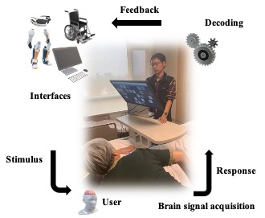
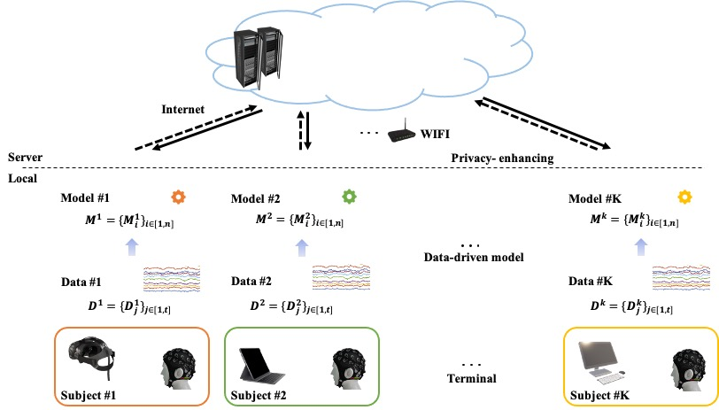

# A Novel Engine for Brain-computer Interfaces

The project is ongoing...

## What is it?

## Usage Locally

## Modules and Vital Functions

### 1. Software Design Automation

* Multi-task... 
     
   Ref: Learn2Reg: comprehensive multi-task medical image registration challenge, dataset and evaluation in the era of deep learning 
 
* EEG and EOG based Computer Input Device: 
 

***Slack1: Non-invasive Brain-computer Interface based Controlling of Computer Input Devices*** 

   Ref: Noninvasive neuroimagning enhances continuous neural tracking for robotic device control

### 2. How to train a deep learning model?

 Paradigm designing...
 
### 3. CCA based Plug-and-Play BCI
 https://github.com/aaravindravi/PythonBox_OpenViBE_SSVEP_CCA/blob/master/4ClassCCA.py
 
 
### 4. Communication module
  https://realpython.com/python-sockets/ 
  
  Socket API: https://docs.python.org/3/library/socket.html
  
  **C++-coded client && python-coded server**: 
  1. 利用socket实现python与C++连续通信 https://blog.csdn.net/qq_33485434/article/details/88050577 ，
  2. 利用socket实现C++与python的通信，实现手势识别结果的传输 https://blog.csdn.net/lifeisme666/article/details/117876854?spm=1001.2101.3001.6650.1&utm_medium=distribute.pc_relevant.none-task-blog-2%7Edefault%7ECTRLIST%7ERate-1-117876854-blog-88050577.pc_relevant_default&depth_1-utm_source=distribute.pc_relevant.none-task-blog-2%7Edefault%7ECTRLIST%7ERate-1-117876854-blog-88050577.pc_relevant_default&utm_relevant_index=2 ， 
  3. Python 与 C++ 的进程通信 https://blog.csdn.net/weixin_43152152/article/details/127764569?spm=1001.2101.3001.6650.1&utm_medium=distribute.pc_relevant.none-task-blog-2%7Edefault%7ECTRLIST%7ERate-1-127764569-blog-88050577.pc_relevant_default&depth_1-utm_source=distribute.pc_relevant.none-task-blog-2%7Edefault%7ECTRLIST%7ERate-1-127764569-blog-88050577.pc_relevant_default&utm_relevant_index=1
  4. Python 与 C++ 的进程通信 https://blog.csdn.net/weixin_43152152/article/details/127764569?spm=1001.2101.3001.6650.1&utm_medium=distribute.pc_relevant.none-task-blog-2%7Edefault%7ECTRLIST%7ERate-1-127764569-blog-88050577.pc_relevant_default&depth_1-utm_source=distribute.pc_relevant.none-task-blog-2%7Edefault%7ECTRLIST%7ERate-1-127764569-blog-88050577.pc_relevant_default&utm_relevant_index=1
  5. Python 与 C++ 的进程通信 python之socket编程 https://www.cnblogs.com/aylin/p/5572104.html
  

## Core Technology

### 1. Time synchronization
Ref: Lab Streaming Layer (LSL), https://github.com/sccn/labstreaminglayer

### 2. The primary execution thread and other auxiliary thread
Discuss: What are the primary execution thread and the auxiliary thread in our system?

### 3. 透明  
https://learnopengl-cn.github.io/04%20Advanced%20OpenGL/03%20Blending/

## Environment
*Cross-platform*

 **1. For Windows:** 
 
 Ref: 
 Qt OpenGL https://doc.qt.io/qt-6/qtopengl-index.html  
 Qt OpenGL Demo https://zhuanlan.zhihu.com/p/97457249, https://github.com/linmx0130/QGLDemo/tree/ch0 
 
 
## Architecture

## 系统研发讨论

1. 持续对时序信号做test操作，如果置信度稳定上升，则认为用户在选择某个目标；如果下降又上升，则认为用户在转换目标。
2. 基于扩展交互界面的multi-task, 基于EEG信号的transfer learning 
3. 授时，server端授时，每隔一段时间与client端进行时间校正（代替并口trigger）
4. wifi比蓝牙的带宽高，适合脑电
5. 改DSI函数，实现新的硬件接入
6. 端口号为NeuroScan的端口号

