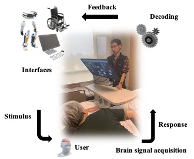

# SSVEP_BCI_for_Andoid

## What is it?

## Usage Locally

## Modules and Vital Functions

### 1. Software Design Automation

* Multi-task... 
     
   Ref: Learn2Reg: comprehensive multi-task medical image registration challenge, dataset and evaluation in the era of deep learning 
 
* EEG and EOG based Computer Input Device: 
 

***Slack1: Non-invasive Brain-computer Interface based Controlling of Computer Input Devices*** 

   Ref: Noninvasive neuroimagning enhances continuous neural tracking for robotic device control

### 2. How to train a deep learning model?

 Paradigm designing...
 
### 3. CCA based Plug-and-Play BCI
 https://github.com/aaravindravi/PythonBox_OpenViBE_SSVEP_CCA/blob/master/4ClassCCA.py

**For Android:** 
 

 Ref: 
 Qt for Android Examples https://doc.qt.io/qt-6/examples-android.html 
 OpenGLES2之Android&iOS跨平台开发教程（一）Android端构建(https://blog.csdn.net/suwk1009/article/details/80583830) 
 
